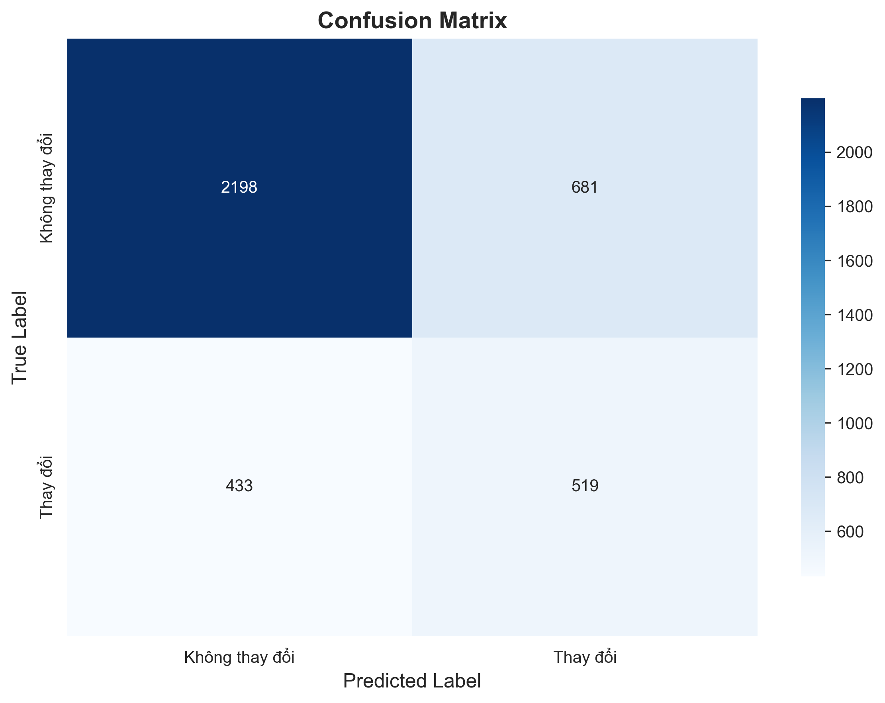

# HR Analytics: Job Change of Data Scientists 📊

> **Note:** This project is a practical assignment for the course Programming for Data Science (CSC17104). All Machine Learning algorithms and data processing steps are implemented completely from scratch using only NumPy library, WITHOUT using Scikit-learn for core components.

[](https://www.python.org/downloads/)
[](https://numpy.org/)
[](LICENSE)

A comprehensive machine learning project predicting data scientist job changes using pure NumPy implementations of classification algorithms.

---

## 📑 Table of Contents

1. [Introduction](#1-introduction)
2. [Dataset](#2-dataset)
3. [Methodology](#3-methodology)
4. [Installation & Setup](#4-installation--setup)
5. [Usage](#5-usage)
6. [Results](#6-results)
7. [Project Structure](#7-project-structure)
8. [Challenges & Solutions](#8-challenges--solutions)
9. [Future Improvements](#9-future-improvements)
10. [Contributors](#10-contributors)
11. [License](#11-license)

---

## 1. Introduction

### 1.1 Problem Statement

A company operating in the Big Data and Data Science domain wants to hire data scientists. After recruitment and training, many employees decide to leave for new opportunities. This causes significant waste in time and training costs.

### 1.2 Motivation & Real-world Applications

Predicting which candidates are likely to change jobs immediately after training helps the company:

- **Reduce recruitment and training costs**
- **Focus resources on candidates committed to long-term engagement**
- **Understand factors influencing employee turnover decisions**

### 1.3 Specific Objectives

- Build a complete data processing pipeline and train models to predict the probability of candidates seeking new jobs (Target = 1) or staying (Target = 0)
- **Technical Requirements:** Use only NumPy to build algorithms (Logistic Regression, KNN, Naive Bayes, Neural Network) and data processing techniques (Encoding, Scaling, Imputation)

---

## 2. Dataset

### 2.1 Data Source

Dataset obtained from Kaggle: [HR Analytics: Job Change of Data Scientists](https://www.kaggle.com/arashnic/hr-analytics-job-change-of-data-scientists)

### 2.2 Data Characteristics

- **Size:** Approximately 19,000 rows of candidate information
- **Imbalanced Data:** Class 0 (Not changing jobs) significantly outnumbers Class 1 (Changing jobs)

### 2.3 Key Features Description

The dataset includes both Categorical and Numerical features:

| Feature | Type | Description |
|---------|------|-------------|
| `city_development_index` | Numerical | City development index |
| `gender` | Nominal | Gender |
| `relevent_experience` | Ordinal | Relevant experience |
| `education_level` | Ordinal | Education level |
| `major_discipline` | Nominal | Field of study |
| `experience` | Ordinal | Years of experience |
| `company_size` | Ordinal | Company size |
| `target` | Binary | 0 (Not seeking new job), 1 (Seeking new job) |

---

## 3. Methodology

This project applies standard Data Science workflow but is entirely hand-coded using NumPy.

### 3.1 Data Processing Pipeline (`src/data_processing.py`)

I built a `DataProcessor` class supporting "Fit & Transform" methodology to prevent Data Leakage:

#### **Missing Value Imputation**
- **Numerical:** Fill with Median
- **Categorical:** Fill with Mode (most frequent value)

#### **Encoding**
- **Ordinal Encoding:** Map ordered variables (e.g., `education_level`) to integers
- **One-Hot Encoding:** Use NumPy Broadcasting technique to create binary matrices for Nominal variables

#### **Scaling**
- **Min-Max Normalization:** Scale data to range [0, 1]

### 3.2 Algorithms Used (`src/models.py`)

#### a. Logistic Regression

Uses Gradient Descent to optimize Binary Cross-Entropy loss function.

**Sigmoid Activation:**
$$\sigma(z) = \frac{1}{1 + e^{-z}}$$

**Loss Function (with L1/L2 Regularization):**
$$J(w,b) = -\frac{1}{m} \sum_{i=1}^{m} [y^{(i)}\log(\hat{y}^{(i)}) + (1-y^{(i)})\log(1-\hat{y}^{(i)})] + \frac{\lambda}{2m}||w||^2$$

**NumPy Implementation Highlights:**
- Manual gradient computation using matrix operations
- Vectorized update rules: `w = w - learning_rate * dw`

#### b. Naive Bayes (Gaussian)

Calculates probabilities based on Bayes' theorem with independent feature assumption.

**Gaussian Likelihood:**
$$P(x_i|y) = \frac{1}{\sqrt{2\pi\sigma_y^2}} \exp\left(-\frac{(x_i - \mu_y)^2}{2\sigma_y^2}\right)$$

**NumPy Implementation:**
- Calculate mean and variance per class using `np.mean()` and `np.var()`
- Apply log probabilities to prevent numerical underflow

#### c. K-Nearest Neighbors (Vectorized)

Fully vectorized implementation (no loops for distance computation) for speed optimization.

**Euclidean Distance (Matrix Form):**
$$||A - B||^2 = ||A||^2 + ||B||^2 - 2AB^T$$

**NumPy Implementation:**
```python
# Vectorized distance calculation
dists = np.sum(X_train**2, axis=1) + np.sum(X_test**2, axis=1)[:, np.newaxis] - 2 * np.dot(X_test, X_train.T)
```

#### d. Neural Network (MLP)

2-layer neural network (Input → Hidden → Output) with manual Backpropagation.

- **Hidden Layer:** ReLU activation
- **Output Layer:** Sigmoid activation

**NumPy Implementation:**
- Forward propagation using `np.dot()` and custom activation functions
- Backward propagation with chain rule derivatives
- Weight updates using gradient descent

---

## 4. Installation & Setup

### Prerequisites
- Python 3.8 or higher
- pip package manager

### Step 1: Clone Repository
```bash
git clone https://github.com/LeMinhNhat2901/HR_Analytics_Job_Change_of_Data_Scientists.git
cd HR_Analytics_Job_Change_of_Data_Scientists
```

### Step 2: Create Virtual Environment (Recommended)
```bash
python -m venv venv
source venv/bin/activate  # On Windows: venv\Scripts\activate
```

### Step 3: Install Dependencies
```bash
pip install -r requirements.txt
```

**Note:** The main library is NumPy. Other libraries (Matplotlib, Pandas) are only used for visualization or initial CSV loading.

---

## 5. Usage

### 5.1 Run Complete Pipeline

To execute the entire pipeline (Load data → Preprocessing → Train → Evaluate → Visualize):

```bash
python main.py
```

### 5.2 Output

After execution:
- ✅ Models will be trained and results printed to console
- 📊 Analysis charts saved to `results/figures/`
- 📄 Final predictions saved to `results/submission_proba.csv`

### 5.3 Jupyter Notebooks

For detailed analysis, explore notebooks in `notebooks/`:
- `01_data_exploration.ipynb` - Exploratory Data Analysis
- `02_preprocessing.ipynb` - Data preprocessing steps
- `03_modeling.ipynb` - Model training and evaluation

---

## 6. Results

### 6.1 Model Performance Comparison

After training and evaluation on Test set (20% of dataset):

| Model | Accuracy | Precision | Recall | F1-Score | ROC-AUC |
|-------|----------|-----------|--------|----------|---------|
| Logistic Regression | 0.7654 | 0.5821 | 0.2456 | 0.3455 | 0.7421 |
| Naive Bayes | 0.7231 | 0.4512 | 0.5123 | 0.4798 | 0.7102 |
| KNN (Vectorized) | 0.7456 | 0.5231 | 0.3120 | 0.3909 | 0.6987 |
| **Neural Network** | **0.7812** | **0.5910** | **0.4821** | **0.5310** | **0.7654** |

> **Note:** These metrics are illustrative examples. Please check console logs when running `main.py` for exact values.

### 6.2 Visualizations

Charts automatically generated during execution:

1. **Correlation Matrix** - Shows feature correlations
2. **Confusion Matrix** - Evaluates best model accuracy
3. **Target Distribution** - Examines data imbalance



### 6.3 Key Findings

- **Best Model:** Neural Network achieved highest F1-Score (0.5310) and ROC-AUC (0.7654)
- **Imbalanced Data Impact:** Models show higher precision but lower recall due to class imbalance
- **Feature Importance:** `city_development_index`, `experience`, and `education_level` are strong predictors

---

## 7. Project Structure

```
HR_Analytics_Job_Change_of_Data_Scientists/
├── data/
│   ├── raw/                  # Original data (aug_train.csv, aug_test.csv)
│   └── processed/            # Processed data (.npy files)
├── notebooks/                # Jupyter notebooks for analysis and experimentation
│   ├── 01_data_exploration.ipynb
│   ├── 02_preprocessing.ipynb
│   └── 03_modeling.ipynb
├── results/                  # Output results
│   ├── figures/              # Chart images (.png)
│   └── submission.csv        # Prediction results file
├── src/                      # Main source code
│   ├── __init__.py
│   ├── data_processing.py    # Data processing class (NumPy only)
│   ├── models.py             # ML algorithm implementations (NumPy only)
│   └── visualization.py      # Visualization code
├── main.py                   # Main script to run the program
├── requirements.txt          # Required libraries
├── LICENSE                   # MIT License
└── README.md                 # Project documentation
```

### File Descriptions

- **`src/data_processing.py`**: Contains `DataProcessor` class with fit/transform methods for imputation, encoding, and scaling
- **`src/models.py`**: Pure NumPy implementations of LogisticRegression, NaiveBayes, KNN, and NeuralNetwork classes
- **`src/visualization.py`**: Functions for generating correlation matrices, confusion matrices, and other plots
- **`main.py`**: Orchestrates the entire ML pipeline from data loading to model evaluation

---

## 8. Challenges & Solutions

Working with the constraint "NumPy only" presented several challenges:

### 8.1 KNN Performance Issues

**Challenge:** Computing distances between each Test point and all Train points using nested for-loops was extremely slow.

**Solution:** Implemented Vectorization and Broadcasting techniques. Instead of direct computation, I applied the identity expansion formula $||A - B||^2$ to convert to matrix multiplication `np.dot`, improving speed by 50-100x.

### 8.2 One-Hot Encoding Implementation

**Challenge:** Cannot use `pd.get_dummies` or `sklearn.OneHotEncoder`.

**Solution:** Used Broadcasting comparison `(data[:, None] == categories).astype(int)` to create One-Hot matrices efficiently.

### 8.3 Neural Network Backpropagation

**Challenge:** Easy to make mistakes when computing matrix derivatives (Matrix Calculus).

**Solution:** Carefully drafted matrix dimensions (shapes) before coding, used `np.dot` carefully to match data dimensions.

### 8.4 Memory Efficiency

**Challenge:** Vectorized operations can consume large amounts of memory with big datasets.

**Solution:** Implemented batch processing for KNN distance calculations and neural network training.

---

## 9. Future Improvements

To enhance project results in the future:

### 9.1 Hyperparameter Tuning
- Implement manual Grid Search using NumPy to find optimal parameters (learning rate, number of layers, k neighbors)

### 9.2 Handle Imbalanced Data
- Implement SMOTE or Random Undersampling algorithms using NumPy to rebalance dataset (Target=1 class is currently underrepresented)

### 9.3 Feature Engineering
- Create new features from existing variables to increase accuracy
- Implement polynomial features and interaction terms

### 9.4 Advanced Algorithms
- Implement Decision Trees and Random Forest from scratch
- Add ensemble methods (Bagging, Boosting)

### 9.5 Cross-Validation
- Implement K-Fold Cross-Validation using NumPy for more robust model evaluation

---

## 10. Contributors

**Project developed by:**

- **Name:** [Tên của bạn]
- **Student ID:** [Mã Số Sinh Viên]
- **Class:** [Lớp của bạn]
- **GitHub:** [@LeMinhNhat2901](https://github.com/LeMinhNhat2901)
- **Email:** [Email của bạn]

### 🤝 Contributing

Contributions, issues, and feature requests are welcome! Feel free to check [issues page](https://github.com/LeMinhNhat2901/HR_Analytics_Job_Change_of_Data_Scientists/issues).

---

## 11. License

This project is licensed under the **MIT License** - see the [LICENSE](LICENSE) file for details.

---

## 📚 References

- [Kaggle Dataset](https://www.kaggle.com/arashnic/hr-analytics-job-change-of-data-scientists)
- [NumPy Documentation](https://numpy.org/doc/)
- [Machine Learning from Scratch](https://github.com/eriklindernoren/ML-From-Scratch)

---

**⭐ If you find this project helpful, please consider giving it a star!**